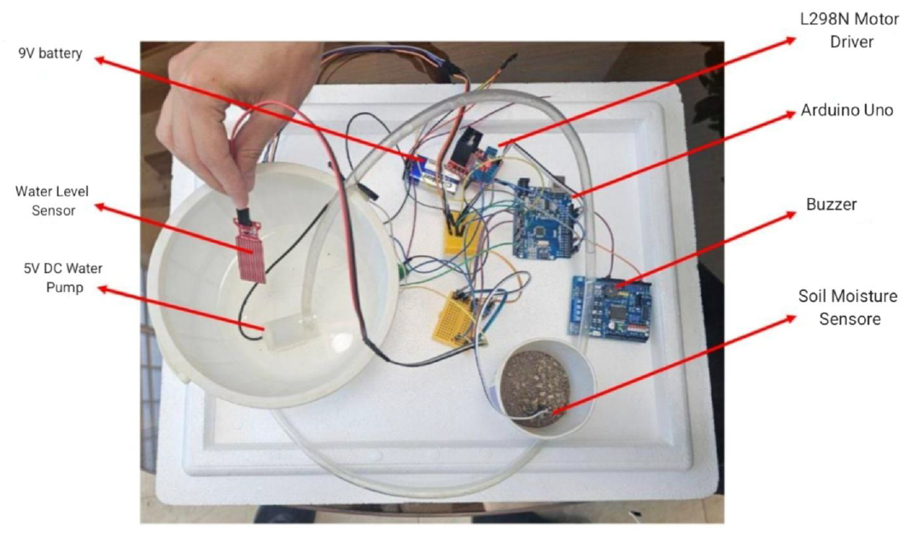
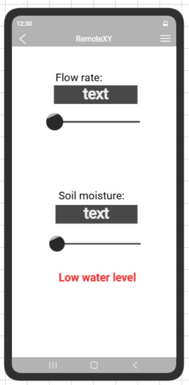
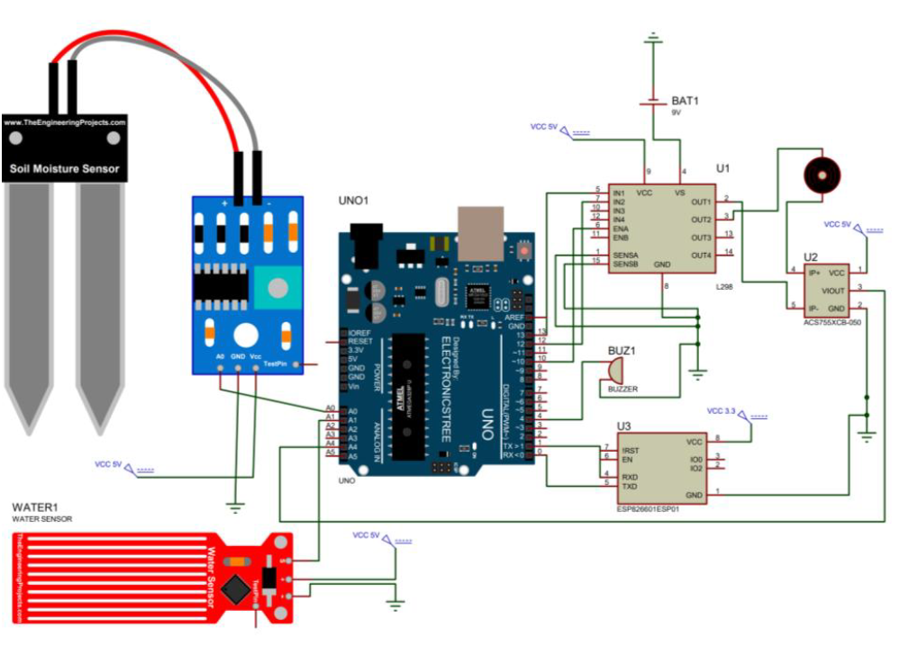

# Arduino-Based Smart Irrigation System with Remote Monitoring and PWM Pump Control

A three-person Applied Electronics course project at Sharif University of Technology. The project implements a physical Arduino-based plant irrigation prototype with soil-moisture sensing, PWM pump actuation, safety monitoring, and a local wireless RemoteXY interface.



## Overview

The Arduino UNO acts as the central controller. It reads soil moisture, reservoir level, and pump-current signals, drives a DC water pump through an L298N motor driver, and communicates with a mobile device through an ESP8266 and RemoteXY.

The system supports user-adjustable moisture and pump settings, low-water and high-current protection, a buzzer alarm, and a reservoir-level-based estimate of water flow. No dedicated flow sensor is used.

## Hardware

- Arduino UNO
- DC water pump
- L298N motor driver
- Soil-moisture sensor
- Water-level sensor
- ACS712 current-sensor module
- ESP8266 Wi-Fi module
- Buzzer
- External pump supply

## Pin Assignment

| Function | Arduino Interface |
|---|---|
| Soil-moisture sensor | A0 |
| Water-level sensor | A1 |
| Current sensor | A4 |
| Pump PWM / L298N ENA | D10 |
| L298N direction inputs | D12, D13 |
| Buzzer | D4 |
| ESP8266 | Hardware serial RX/TX |

## Control Logic

The Arduino reads the soil-moisture sensor and compares the normalized value with the threshold selected through the RemoteXY interface. When irrigation is required, the pump is driven through the L298N using a PWM command generated by the Arduino.

The firmware includes both sensor-dependent pump control and a user-adjustable pump command through the mobile interface.

## Safety Features

Two fault conditions are monitored in the firmware:

- **Low reservoir level:** raw water-level ADC value `< 100`
- **High pump current:** raw current-sensor ADC value `> 700`

When either condition is detected, the pump command is set to zero, the buzzer is activated, and the RemoteXY status field is updated.

These thresholds are implemented as raw ADC limits in the project firmware and are not reported as calibrated physical quantities.

## Remote Interface

The ESP8266 provides the wireless link between the Arduino and the RemoteXY mobile interface. The user can:

- View the soil-moisture level
- View the estimated flow-rate value
- Adjust the soil-moisture threshold
- Adjust the pump command
- Monitor low-water and high-current fault states



## Flow-Rate Estimation

The prototype does not use a dedicated flow sensor. Instead, the firmware estimates water flow from the change in the reservoir-level sensor reading over an approximately one-second interval:

```text
Q_est = (previous_level_reading - current_level_reading) * 0.52
```

The project report states that the coefficient `0.52` combines the reservoir cross-sectional area with a water-level sensor calibration factor. Since the report does not provide the underlying calibration data or final physical unit, the result is described here as a **flow-rate estimate** rather than a calibrated direct flow measurement.

## System Schematic



## Repository Structure

```text
arduino-smart-irrigation-system/
├── README.md
├── firmware/
│   └── smart_irrigation_system.ino
├── figures/
│   ├── prototype.png
│   ├── remotexy_interface.png
│   └── system_schematic.png
├── report/
│   └── Applied_Electronics_Project_Report.pdf
└── .gitignore
```

## Course Context

**Course:** Applied Electronics  
**Institution:** Sharif University of Technology  
**Original project title:** Smart Plant Irrigation System with Remote Flow Control  
**Team size:** 3

### Team Members

- Aryan Mollazadeh
- Mohammad Sadegh Dehghani
- Peyman Shahheidari

The project report does not specify individual responsibilities within the team.

## Project Report

The complete course report, including the system description, hardware setup, schematic, firmware listing, RemoteXY interface, and prototype photographs, is available in [`report/Applied_Electronics_Project_Report.pdf`](report/Applied_Electronics_Project_Report.pdf).
